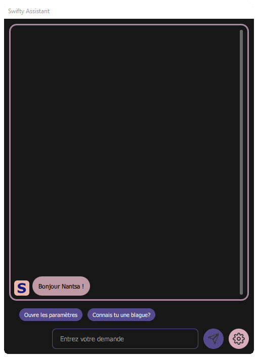

# Swifty Assistant

[](https://www.gnu.org/licenses/gpl-3.0.html) [](https://github.com/Swiftapp-hub/Swifty-Assistant/issues) [](https://github.com/Swiftapp-hub/Swifty-Assistant/commits/develop)

Swifty Assistant is a simple, user-friendly assistant based on an extension system.

Swifty is a personal assistant created to be useful to both beginners and computer experts!
It works offline and does not collect any personal data!
If you like Swifty and are useful to you, please feel free to contribute to the project, thank you.
I'm French so the English version of Swift isn't fully up to date, but if you want to improve don't hesitate!

Screenshoot:

 

## Get Swifty Assistant

#### Install

Swifty Assistant can be installed with the online installer.

Follow the instructions below to download and install Swift Assistant:

1. [Download](https://github.com/Swiftapp-hub/Swifty-Assistant/releases/) Swifty Assistant online installer
2. Right click on the download file and go to the properties
3. Go to the permissions tab and check the box "Allow file execution as a program"
4. Now double click on the .run file to launch Swifty Assistant online installer

#### Update or remove

To update or delete Swifty Assistant use the maintenance tool.

To open it here are two methods:

*   Run this command `exec $HOME/SwiftyAssistant/maintenancetool`
*   Open your application launcher and search for "Swifty Assistant update or remove"

## Manual installation

Follow these steps if you want to compile Swifty Assistant on your own

### Dependencies

To compile Swifty Assistant you need to have installed:

Qt >= 5.15.2 with at least the following modules:

* [qtbase](http://code.qt.io/cgit/qt/qtbase.git)
* [qtwebengine](https://code.qt.io/cgit/qt/qtwebengine.git)
* [qtquickcontrols2](https://code.qt.io/cgit/qt/qtquickcontrols2.git)

and you must have the **build-essential** package installed.

I recommend you to install Qt with the official installer from the Qt site

### Build

You need to run the following commands to compile Swifty Assistant:

```bash
cd "FOLDER_OF_GIT_CLONE"
```

```bash
lrelease SwiftyAssistant.pro
```

```bash
mkdir build && cd build
```

```bash
qmake ../
```

```bash
make
```

## Plugins

List of available plugins for Swifty Assistant:

* [HelloWord](https://github.com/Swiftapp-hub/HelloWorld-Plugin-Swifty-Assistant)
* [ControlSettings](https://github.com/Swiftapp-hub/ControlSettings-Plugin-Swifty-Assistant)

If you have created a plugin, consider adding it to this list!

## Contribution

Here's what you can do to contribute to the project:

* If you want to improve this project, clone this repository
* If you want to create new plugins for Swifty or improve an existing plugin read the documentation

Thank you in advance for your help.

## License

This project is licensed under the GNU General Public License version 3

You will find a copy of this license in the file [LICENSE.md](https://github.com/Swiftapp-hub/Swifty-Assistant/blob/master/LICENSE.md)
